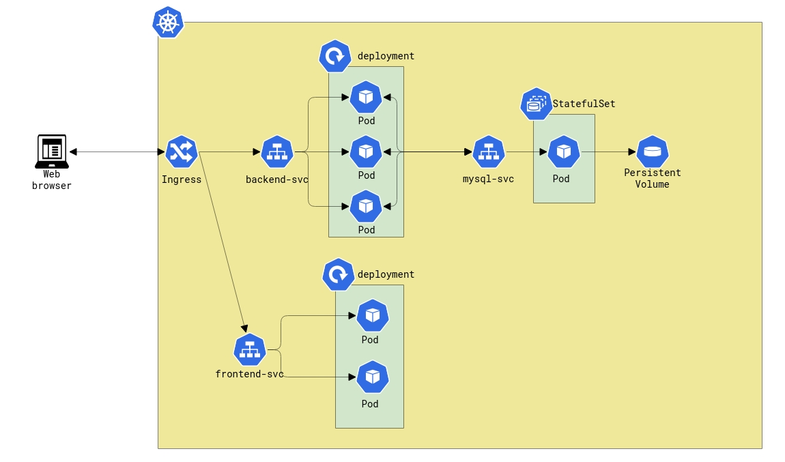
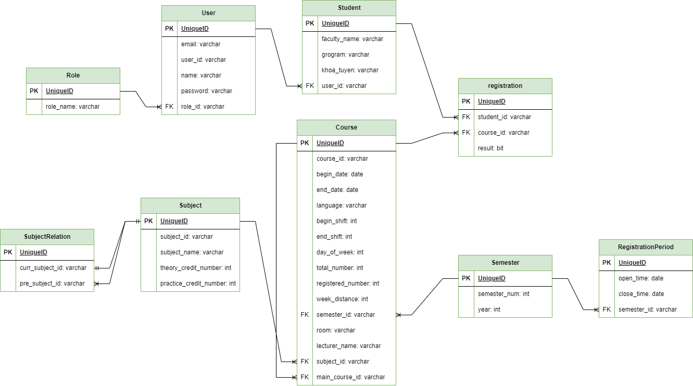

# Course Registration App

Building a course registration website using ReactJS and Spring boot. This build covers basic funtionalities of a course registration application such as register new courses, cancel enrolled courses, allow admin to add new courses

## Architecture

1. I have deployed the project on minikube for testing purpose. For more detail about infrastructure, visit at "k8s/application" folder. Here is the architect of my course registration system on k8s:

2. This is the database design of my course registration project:

